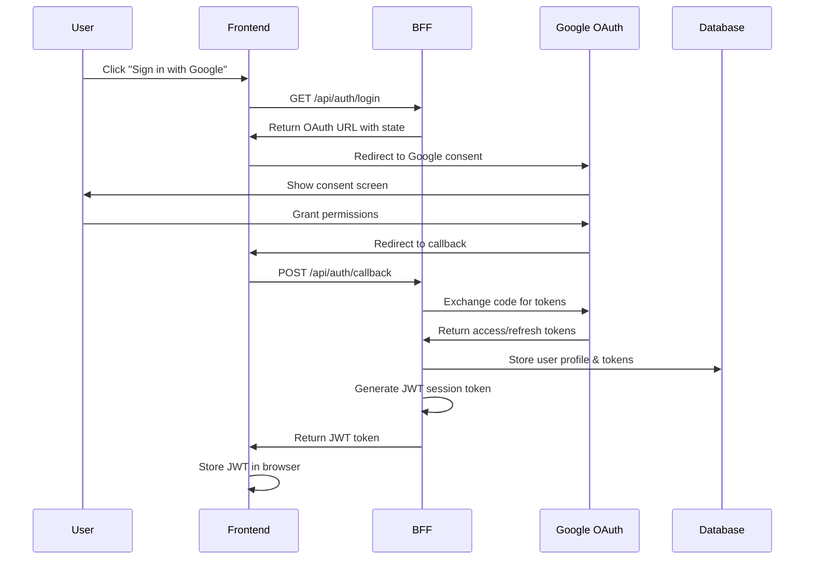
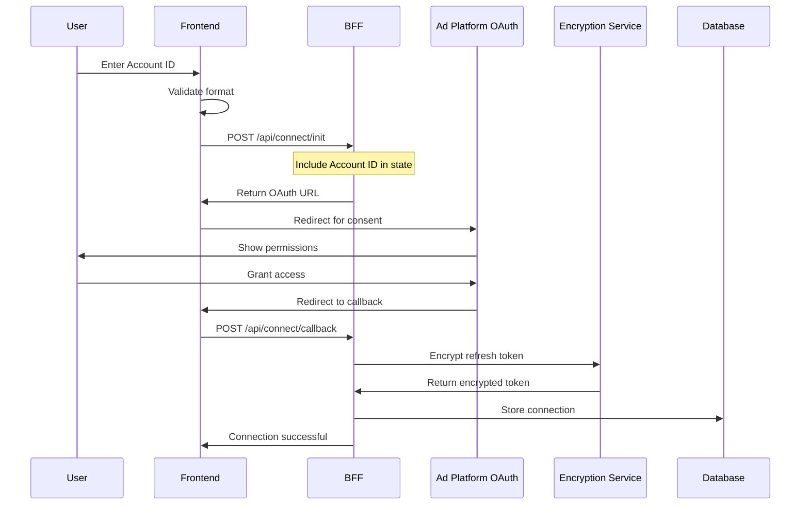
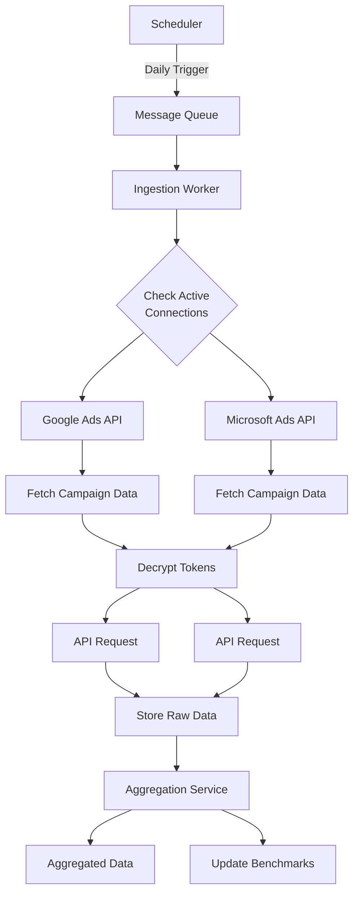
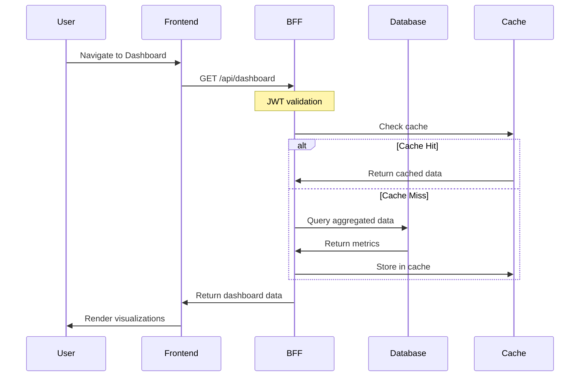

# Collaborative Advertising Platform (CAP)

A multi-tenant SaaS platform that aggregates advertising data from multiple sources (Google Ads, Microsoft Ads) to provide unified insights, benchmarking capabilities, and collaborative analytics for digital marketing agencies.

## Table of Contents

- [Overview](#overview)
- [System Architecture](#system-architecture)
- [Data Flow](#data-flow)
- [Security](#security)
- [Technology Stack](#technology-stack)
- [Getting Started](#getting-started)
- [Deployment](#deployment)
- [API Documentation](#api-documentation)
- [Development](#development)
- [Monitoring & Maintenance](#monitoring--maintenance)

## Overview

The Collaborative Advertising Platform enables digital marketing agencies to:
- Connect multiple Google Ads and Microsoft Ads accounts
- Aggregate performance data across all managed accounts
- Generate industry benchmarks from anonymized data
- Share insights while maintaining data privacy
- Track campaign performance with unified dashboards

### Key Features

- **Unified OAuth Authentication**: Single sign-on with Google accounts
- **Multi-Account Management**: Connect and manage multiple ad accounts
- **Privacy-First Design**: Data isolation and encryption at rest
- **Real-Time Dashboards**: Performance metrics and visualizations
- **Benchmark Analytics**: Compare performance against industry standards
- **Role-Based Access Control**: Admin, Agency, and Guest roles

## System Architecture

### High-Level Architecture

```
┌─────────────────────────────────────────────────────────────────────┐
│                          User Browser                                │
└─────────────────────────┬───────────────────────────────────────────┘
                          │
                          ▼
┌─────────────────────────────────────────────────────────────────────┐
│                    Frontend (Next.js)                                │
│                 Serverless Container                                 │
│              • React + Material-UI                                   │
│              • JWT-based authentication                              │
│              • Real-time dashboards                                  │
└─────────────────────────┬───────────────────────────────────────────┘
                          │
                          ▼
┌─────────────────────────────────────────────────────────────────────┐
│                Backend for Frontend (BFF)                            │
│                  Serverless Container                                │
│              • Express + TypeScript                                  │
│              • JWT validation middleware                             │
│              • API aggregation & transformation                      │
└──────┬─────────────────┬────────────────────┬──────────────────────┘
       │                 │                    │
       ▼                 ▼                    ▼
┌──────────────┐ ┌──────────────┐ ┌────────────────────┐
│ Google OAuth │ │ Data         │ │ Secret Manager &   │
│     2.0      │ │ Warehouse    │ │ Key Management     │
└──────────────┘ └──────────────┘ └────────────────────┘
       │                 │                    │
       ▼                 ▼                    ▼
┌──────────────────────────────────────────────────────────┐
│              External APIs & Services                      │
│  • Google Ads API                                         │
│  • Microsoft Ads API                                      │
│  • Scheduling Services                                    │
│  • Data Processing Workers                               │
└──────────────────────────────────────────────────────────┘
```

### Component Details

#### Frontend Application
- **Technology**: Next.js App Router, React, Material-UI, TypeScript
- **Authentication**: Unified Google OAuth with JWT session management
- **Key Features**:
  - Server-side rendering for performance
  - Progressive Web App capabilities
  - Responsive design for all devices
  - Real-time data updates

#### Backend for Frontend (BFF)
- **Technology**: Node.js, Express, TypeScript
- **Purpose**: API gateway and business logic layer
- **Responsibilities**:
  - JWT token validation
  - Request aggregation from multiple data sources
  - Data transformation and formatting
  - Rate limiting and security enforcement
  - Caching for performance optimization

#### Data Storage Architecture

```
Data Warehouse Structure:
┌─────────────────────────────────────────────────────────┐
│                    Private Data Layer                    │
│  • User profiles and authentication                     │
│  • Account connections and encrypted tokens             │
│  • Raw campaign performance metrics                     │
│  • Data sharing preferences                            │
└─────────────────────────────────────────────────────────┘
                           │
                           ▼
┌─────────────────────────────────────────────────────────┐
│                  Aggregated Data Layer                   │
│  • Cross-account anonymized metrics                     │
│  • Industry performance benchmarks                      │
│  • Time-series trend analysis                          │
└─────────────────────────────────────────────────────────┘
```

## Data Flow

### 1. Authentication Flow



### 2. Ad Platform Connection Flow



### 3. Data Ingestion Flow



### 4. Dashboard Data Flow



## Security

### Authentication & Authorization

#### 1. OAuth 2.0 Architecture
```typescript
// JWT Token Structure
interface JWTPayload {
  sub: string;              // User ID
  email: string;            // User email
  name: string;             // Display name
  picture?: string;         // Profile picture URL
  role: UserRole;           // Access level
  organizationId?: string;  // Organization identifier
  permissions?: string[];   // Specific permissions
  iat: number;              // Issued at
  exp: number;              // Expiration time
}
```

#### 2. Role-Based Access Control (RBAC)
```typescript
enum UserRole {
  ADMIN = 'admin',          // Platform administrators
  ORGANIZATION = 'org',     // Organization users
  VIEWER = 'viewer'         // Read-only access
}

// Middleware enforcement examples
requireRole(UserRole.ADMIN)        // Admin-only endpoints
requireOrganizationAccess()        // Organization data isolation
requirePermission('export_data')   // Specific permission checks
```

#### 3. API Security Measures
- **Rate Limiting**: Configurable per endpoint and user tier
- **CORS Policy**: Restricted to authorized origins
- **Input Validation**: Schema validation for all inputs
- **SQL Injection Prevention**: Parameterized queries
- **XSS Protection**: Content Security Policy headers
- **CSRF Protection**: Token-based validation

### Data Protection

#### 1. Encryption Architecture
```yaml
At Rest:
  - Database: AES-256 encryption
  - OAuth Tokens: Additional encryption layer
  - File Storage: Encrypted buckets

In Transit:
  - All APIs: TLS 1.3 minimum
  - Internal Services: mTLS
  - Frontend Assets: HTTPS only
```

#### 2. Data Isolation
- Row-level security in database
- Organization-based data segregation
- Separate encryption keys per organization
- Audit logs for all data access

#### 3. Secret Management
- Centralized secret storage
- Automatic rotation policies
- Environment-specific secrets
- No hardcoded credentials

### Privacy & Compliance

#### 1. Data Anonymization Rules
- Minimum aggregation thresholds
- No individual identification possible
- Rolling aggregation windows
- Statistical noise for privacy

#### 2. Audit Trail
```typescript
interface AuditLog {
  timestamp: Date;
  userId: string;
  action: string;
  resource: string;
  ipAddress: string;
  userAgent: string;
  success: boolean;
  metadata?: object;
}
```

#### 3. Data Retention
- Configurable retention policies
- Automatic data purging
- Compliance with regulations
- User data export capabilities

## Technology Stack

### Frontend
- **Framework**: Next.js 14+
- **UI Library**: Material-UI or similar
- **State Management**: Context API / Redux / Zustand
- **Data Fetching**: TanStack Query / SWR
- **Forms**: React Hook Form
- **Validation**: Zod / Yup
- **Testing**: Jest, React Testing Library

### Backend
- **Runtime**: Node.js 18+
- **Framework**: Express / Fastify
- **Language**: TypeScript
- **Database**: PostgreSQL / BigQuery
- **ORM/Query Builder**: Prisma / Knex
- **Authentication**: JWT / OAuth 2.0
- **API Documentation**: OpenAPI 3.0

### Infrastructure
- **Container Platform**: Docker
- **Orchestration**: Kubernetes / Cloud Run
- **Message Queue**: Pub/Sub / RabbitMQ
- **Caching**: Redis
- **Monitoring**: Prometheus / Grafana
- **Logging**: ELK Stack / Cloud Logging
- **CI/CD**: GitHub Actions / GitLab CI

## Getting Started

### Prerequisites
- Node.js 18+ and npm/yarn
- Docker (optional for containerized development)
- Cloud provider CLI tools
- Git

### Local Development Setup

1. **Clone Repository**
   ```bash
   git clone <repository-url>
   cd collaborative-advertising-platform
   ```

2. **Install Dependencies**
   ```bash
   # Install all dependencies
   npm install
   
   # Or using workspaces
   npm run install:all
   ```

3. **Environment Configuration**
   
   Create environment files:
   
   **Frontend** (`.env.local`):
   ```env
   NEXT_PUBLIC_API_URL=http://localhost:8080
   NEXT_PUBLIC_ENVIRONMENT=development
   ```
   
   **Backend** (`.env`):
   ```env
   NODE_ENV=development
   PORT=8080
   DATABASE_URL=postgresql://...
   JWT_SECRET=your-secret-key
   FRONTEND_URL=http://localhost:3000
   ```

4. **Database Setup**
   ```bash
   # Run migrations
   npm run db:migrate
   
   # Seed development data
   npm run db:seed
   ```

5. **Start Development Servers**
   ```bash
   # Run all services
   npm run dev
   
   # Or run individually
   npm run dev:frontend
   npm run dev:backend
   ```

### Development Workflow

1. **Code Quality**
   ```bash
   npm run lint          # Linting
   npm run typecheck     # Type checking
   npm run test          # Unit tests
   npm run test:e2e      # E2E tests
   ```

2. **Building**
   ```bash
   npm run build         # Build all
   npm run build:docker  # Docker images
   ```

## Deployment

### Container-Based Deployment

```bash
# Build containers
docker build -t cap-frontend ./frontend
docker build -t cap-backend ./backend

# Run with Docker Compose
docker-compose up -d

# Or deploy to Kubernetes
kubectl apply -f k8s/
```

### Cloud Deployment

#### Using CI/CD
```yaml
# Example GitHub Actions workflow
name: Deploy
on:
  push:
    branches: [main]
jobs:
  deploy:
    runs-on: ubuntu-latest
    steps:
      - uses: actions/checkout@v3
      - name: Deploy to Cloud
        run: |
          npm run deploy:production
```

#### Manual Deployment
```bash
# Deploy backend
cd backend
npm run build
npm run deploy

# Deploy frontend
cd frontend
npm run build
npm run deploy
```

### Post-Deployment Checklist

- [ ] Verify OAuth redirect URLs
- [ ] Test authentication flow
- [ ] Check database connectivity
- [ ] Validate API endpoints
- [ ] Monitor application logs
- [ ] Set up alerts

## API Documentation

### Authentication Endpoints

```http
# Initiate login
GET /api/v1/auth/login
Response: { authUrl: string }

# OAuth callback
POST /api/v1/auth/callback
Body: { code: string, state: string }
Response: { token: string, user: User }

# Get current user
GET /api/v1/auth/me
Authorization: Bearer <token>
Response: { user: User }

# Logout
POST /api/v1/auth/logout
Authorization: Bearer <token>
Response: { success: boolean }
```

### Platform Integration

```http
# Initialize connection
POST /api/v1/platforms/:platform/connect
Authorization: Bearer <token>
Body: { accountId: string }
Response: { authUrl: string }

# List connected accounts
GET /api/v1/platforms/:platform/accounts
Authorization: Bearer <token>
Response: { accounts: Account[] }
```

### Analytics Endpoints

```http
# Dashboard metrics
GET /api/v1/analytics/dashboard
Authorization: Bearer <token>
Query: { startDate, endDate, metrics[] }
Response: { 
  metrics: MetricData[],
  trends: TrendData[],
  benchmarks: BenchmarkData[]
}

# Export data
POST /api/v1/analytics/export
Authorization: Bearer <token>
Body: { format: 'csv' | 'json', filters: {...} }
Response: { downloadUrl: string }
```

### Error Response Format

```typescript
interface ErrorResponse {
  error: {
    code: string;
    message: string;
    details?: object;
  };
  statusCode: number;
  timestamp: string;
  requestId: string;
}
```

## Development Best Practices

### Code Organization
```
src/
├── components/     # Reusable UI components
├── pages/          # Page components
├── hooks/          # Custom React hooks
├── utils/          # Utility functions
├── services/       # API services
├── store/          # State management
├── types/          # TypeScript types
└── styles/         # Global styles
```

### Coding Standards
- Use TypeScript strict mode
- Follow ESLint rules
- Write unit tests for utilities
- Document complex functions
- Use meaningful variable names
- Keep functions small and focused

### Git Workflow
```bash
# Feature development
git checkout -b feature/description
git add .
git commit -m "feat: add new feature"
git push origin feature/description

# Commit types
feat:     # New features
fix:      # Bug fixes
docs:     # Documentation
style:    # Code style
refactor: # Code refactoring
test:     # Test updates
chore:    # Maintenance
```

## Monitoring & Maintenance

### Application Metrics
- **Response Time**: Track p50, p95, p99
- **Error Rate**: Monitor 4xx and 5xx errors
- **Throughput**: Requests per second
- **Resource Usage**: CPU, memory, disk

### Health Checks
```http
GET /health
Response: {
  status: 'healthy',
  version: '1.0.0',
  uptime: 3600,
  dependencies: {
    database: 'connected',
    cache: 'connected',
    queue: 'connected'
  }
}
```

### Logging Strategy
```typescript
// Structured logging
logger.info('Operation completed', {
  operation: 'data_export',
  userId: user.id,
  duration: 1234,
  recordCount: 5000
});
```

### Maintenance Schedule

#### Daily Tasks
- Review error logs
- Check system health
- Monitor queue sizes
- Verify data freshness

#### Weekly Tasks
- Update dependencies
- Review performance metrics
- Check storage usage
- Audit access logs

#### Monthly Tasks
- Security patches
- Performance optimization
- Documentation updates
- Disaster recovery tests

## Troubleshooting

### Common Issues

#### Authentication Problems
- Verify OAuth configuration
- Check token expiration
- Validate redirect URLs
- Review CORS settings

#### Performance Issues
- Check database indexes
- Review query optimization
- Monitor cache hit rates
- Analyze slow endpoints

#### Data Inconsistencies
- Verify data pipeline status
- Check transformation logic
- Review aggregation rules
- Validate time zones

### Debug Tools
```bash
# View application logs
docker logs <container-id>

# Check database connections
npm run db:check

# Test API endpoints
npm run test:api

# Profile performance
npm run profile
```

## Contributing

### Getting Started
1. Fork the repository
2. Create a feature branch
3. Make your changes
4. Add tests
5. Submit a pull request

### Code Review Process
- Automated checks must pass
- At least one approval required
- Documentation must be updated
- Tests must cover new code

### Release Process
1. Version bump
2. Update changelog
3. Create release notes
4. Tag release
5. Deploy to production

## Support

### Documentation
- Architecture Guide
- API Reference
- Deployment Guide
- Security Best Practices

### Getting Help
- Check documentation first
- Search existing issues
- Create detailed bug reports
- Join community discussions

## License

This project is proprietary software. See LICENSE file for details.